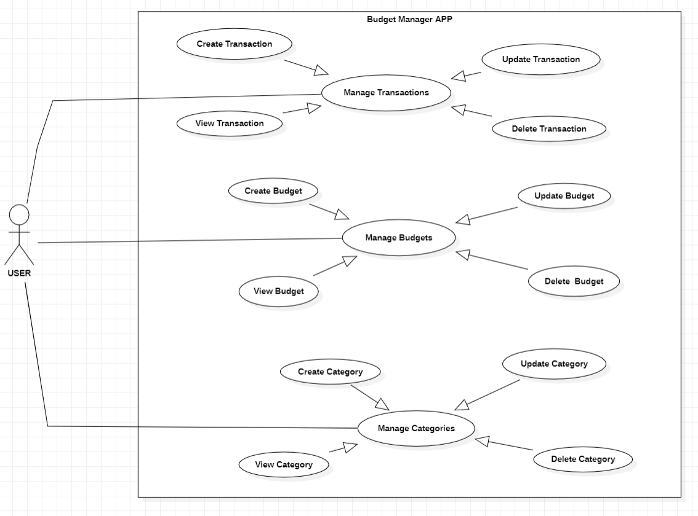

## USE CASE Diagram

---
## SEQUENCE Diagram

---
## CLASS Diagram

---

# Budget Manager Application

## Overview

The **Budget Manager** is a financial management application designed to help users track their expenses, manage budgets, and organize transactions and categories. The application allows users to add, edit, view, and delete financial transactions, manage budgets by setting spending limits, and create custom categories for better organization. Built using **Spring Boot** for the backend and **Angular 16+** for the frontend, this app follows best practices in software development, ensuring scalability, maintainability, and user-friendly design.

## Features

### Transaction Management

* Add new financial transactions, specifying the amount, category, date, and description.
* View a list of all transactions with the ability to filter and sort by date, amount, or category.
* Edit the details of an existing transaction (amount, category, date, description).
* Delete a previously recorded transaction.

### Budget Management

* Create a new budget by setting a spending limit for specific categories such as food, housing, and transportation.
* View current budgets, displaying the limits set and amounts spent so far.
* Adjust budget limits for categories as needed.
* Delete an existing budget.

### Category Management

* Create custom categories to organize both expenses and income.
* Modify or delete an existing category.

## Technologies Used

### Backend

* **Spring Boot**: A framework for building Java-based web applications.
* **Spring Data JPA**: Simplifies database interaction with Java Persistence API (JPA).
* **Lombok**: A Java library used to reduce boilerplate code, such as getters and setters.
* **MapStruct**: A code generator used to map between Java beans.
* **JUnit**: A framework for writing and running unit tests.

### Frontend

* **Angular 17**: A popular framework for building single-page applications (SPA).
* **RxJS**: A library for reactive programming using observables.
* **Angular Forms**: For building and managing forms in Angular.
* **Tailwind**: CSS frameworks for designing responsive and modern user interfaces.
* **HttpClient**: Angular service for making HTTP requests.
* **Angular Router**: A routing library for navigating between different views in the application.

## [Postman Link ](https://bold-space-353782.postman.co/workspace/My-Workspace~49aab289-6de5-487b-8f91-58ce1aacf8db/collection/41299916-a2f94e09-8ed8-46d4-a25b-861447eca428?action=share&creator=41299916)

